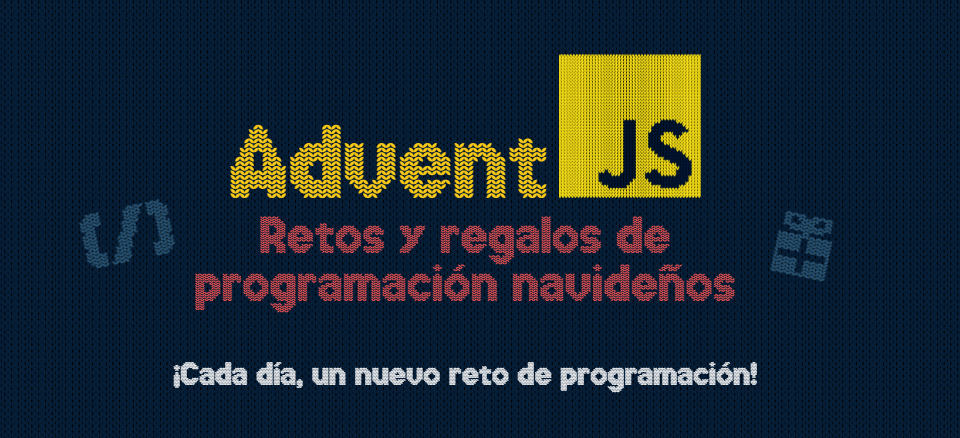

# 🎅 AdventJS-2023 ⛄

👋 ¡Bienvenid@ al Calendario de AdventJS! Este repositorio almacena mis soluciones a los retos diarios propuestos por @midudev durante el mes de diciembre. Cada día, se desbloquea un nuevo desafío, ofreciendo una oportunidad emocionante para mejorar mis habilidades en JavaScript.

Además, estoy aprovechando estos retos como parte de mi aprendizaje en el bootcamp de **FemCoders**.

## 📝 Mis soluciones para el Advent JS de la edición 2023, organizada por @midudev 😉

➜ Dentro de cada enlace encontrarás las instrucciones al reto junto con mis soluciones, así como el testing con Jest. 

| Día | Título                             | Dificultad | Solución           |
| --- | ---------------------------------- | ---------- | ------------------ |
| 01  | 🎁 ¡Primer regalo repetido!        | 🟢 Fácil   | [Ver solución](./Retos/Reto01/) |
| 02  | 🏭 Ponemos en marcha la fábrica    | 🟢 Fácil   | [Ver solución](./Retos/Reto02/) |
| 03  | 😏 El elfo travieso                | 🟢 Fácil   |  |
| 04  | 😵‍💫 Dale la vuelta a los paréntesis | 🟡 Media   |  |
| 05  | 🛷 El CyberTruck de Santa          | 🟡 Media   |  |
| 06  | 🦌 Los renos a prueba              | 🟢 Fácil   |  |
| 07  | 📦 Las cajas en 3D                 | 🟢 Fácil   |  |
| 08  | 🏬 Ordenando el almacén            | 🟡 Media   |  |
| 09  | 🚦 Alterna las luces               | 🟢 Fácil   |  |
| 10  | 🎄 Crea tu propio árbol de navidad | 🟢 Fácil   |  |
| 11  | 📖 Los elfos estudiosos            | 🟡 Media   |  |
| 12  | 📸 ¿Es una copia válida?           | 🟡 Media   |  |
| 13  | ⌚️ Calculando el tiempo           | 🟢 Fácil   |  |
| 14  | 🚨 Evita la alarma                 | 🟡 Media   |  |
| 15  | ↔️ Robot autónomo                  | 🟡 Media   |  |
| 16  | ❌ Despliegue en viernes           | 🟢 Fácil   |  |
| 17  | 🛷 Optimizando el alquiler         | 🟢 Fácil   |  |
| 18  | 🔢 El reloj digital                | 🔴 Difícil |  |
| 19  | 💣 Enfrenta el sabotaje            | 🟡 Media   |  |
| 20  | 🏋️‍♂️ Distribuye el peso              | 🔴 Difícil |  |
| 21  | 🪐 Mensaje binario                 | 🟡 Media   |  |
| 22  | 🚂 Lenguaje de programación        | 🟢 Fácil   |  |
| 23  | 🍽️ La comida de Navidad            | 🟢 Fácil   |  |
| 24  |                                    | ...        |  |
| 25  |                                    | ...        |  |

---

## ✅ Enlaces de Interés

- Midudev

    - **[Midudev en GitHub](https://github.com/midudev)**
    - **[Midudev en YouTube](https://www.youtube.com/c/midudev)**
    - **[Midudev en Twitch](https://www.twitch.tv/midudev)**

- Factoria F5
    - **[FemCoders](https://femcoders.factoriaf5.org/)**
    - **[Factoria F5](https://factoriaf5.org/)**

## 💜 Agradecimientos

Quiero expresar mi agradecimiento a:

- **[Midudev](https://twitter.com/midudev)**: Por la increíble iniciativa de crear el Calendario de Adviento de Retos de JavaScript.

- **[Factoria F5](https://factoriaf5.org/)**: Por brindarme la oportunidad de participar en el bootcamp. Aprecio la dedicación de Factoria F5 para crear un entorno de aprendizaje a través de la pedagogía activa.

¡Gracias a ambos por contribuir a mi crecimiento y desarrollo como desarrolladora! 😊